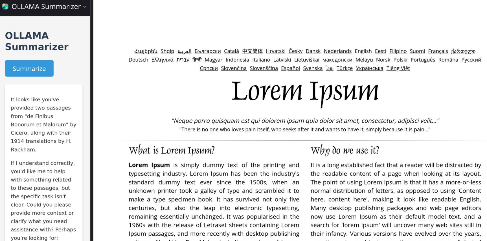

# SpaceLLama

SpaceLLama is a powerful browser extension that leverages OLLAMA to provide quick and efficient web page summarization. It offers a seamless way to distill the essence of any web content, saving you time and enhancing your browsing experience.

**[Download it from the Mozilla Extensions store!](https://addons.mozilla.org/en-US/firefox/addon/spacellama/)**

## Features

- **One-Click Summarization**: Quickly summarize any web page with a single click.
- **Sidebar Integration**: View summaries in a convenient sidebar without leaving the current page.
- **Customizable OLLAMA Settings**: Easily configure the OLLAMA endpoint and model through the options page.
- **Markdown Rendering**: Summaries are rendered in Markdown for better readability and formatting.
- **Error Handling**: Robust error handling with informative messages for troubleshooting.
- **Token Limit Handling**: Ability to set a token limit for the summary.
- **Recursive Summarization with Context Chunking**: Recursively summarizes content that exceeds the token limit by breaking it into smaller chunks, summarizing each chunk, and then combining the summaries to provide a more comprehensive summary (only if the token limit is exceeded).

## How It Works

1. Click the SpaceLLama icon in your browser toolbar to open the sidebar.
2. Navigate to the web page you want to summarize.
3. Click the "Summarize" button in the sidebar.
4. Wait for a few seconds as SpaceLLama processes the page content.
5. Read the concise summary presented in the sidebar.

## Configuration

You can customize SpaceLLama's behavior through the options page:

1. Click the "Open Settings" button in the sidebar.
2. Set your preferred OLLAMA endpoint (default is `http://localhost:11434`).
3. Choose the OLLAMA model you want to use (default is `llama2`).
4. Save your settings.

## Technical Details

SpaceLLama is built using standard web technologies and the WebExtensions API. It consists of:

- A background script for handling API requests to OLLAMA.
- A content script for extracting page content.
- A sidebar interface for user interaction and displaying summaries.
- An options page for customizing settings.

The extension uses the `marked` library to render Markdown content in the summary view.

## Privacy and Security

SpaceLLama processes web page content locally through your configured OLLAMA endpoint. No data is sent to external servers beyond what you configure. Always ensure you're using a trusted OLLAMA setup, especially if using a remote endpoint.

## FAQ

- If you get a 403 error, you probably need to set the environment variable `OLLAMA_ORIGINS` to "\*" on your ollama server. On Windows, you will have to set the environment variable in the `SYSTEM` environment, not just the `USER` environment.

## Contributing

Contributions to SpaceLLama are welcome! Please feel free to submit issues, feature requests, or pull requests to help improve the extension.

## License

Licensed under the [Do What The Fuck You Want To Public License](LICENSE.md).
See [LICENSE.md](LICENSE.md) for more details.

---

SpaceLLama: Bringing the power of OLLAMA to your browser for effortless web page summarization.
